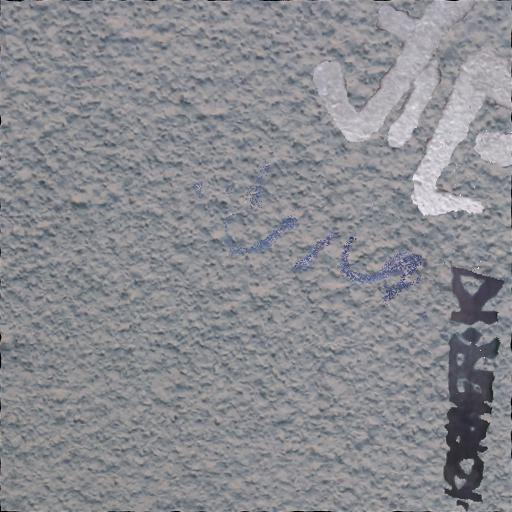
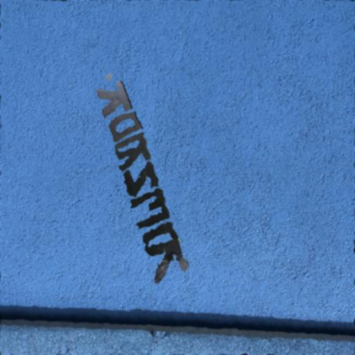
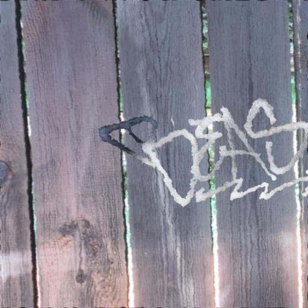
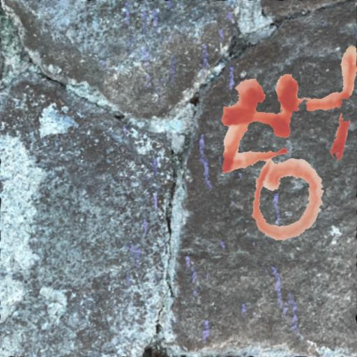
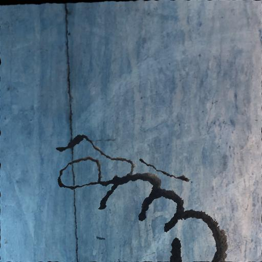
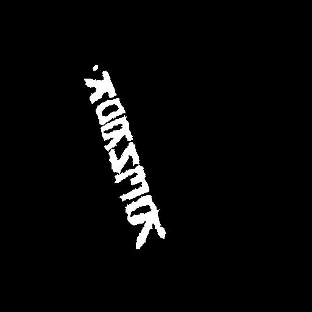
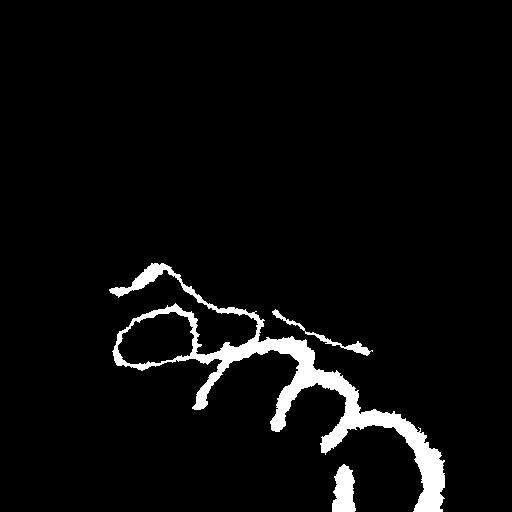

# DeepClean - Graffiti remover


## Training data

<table>
<tr>
<td></td>
<td></td>
<td></td>
<td></td>
<td></td>
</tr>
<tr>
<td></td>
<td></td>
<td></td>
<td></td>
<td></td>
</tr>
</table>

```python
# Augmentations applied to single graffiti samples later copied to a new background
graffiti_image_augmentations = iaa.Sequential([
    iaa.ElasticTransformation(alpha=20, sigma=4),
    iaa.Add((-4, 4), per_channel=0.5),
    iaa.Affine(shear=(-16, 16)),
    iaa.Affine(scale=(0.6, 0.9)),
    iaa.Affine(rotate=(-30, 30)),
    iaa.Affine(translate_px={
        "x": (-200, 200),
        "y": (-200, 200)
    }),
    iaa.Fliplr(0.5),
    iaa.Flipud(0.5),
    iaa.GaussianBlur(sigma=(0.0, 1.0)),
])

# Augmentations applied to a random background to be used for new graffiti sample
background_image_augmentations = iaa.Sequential([
    iaa.ElasticTransformation(alpha=20, sigma=4),
    iaa.GaussianBlur(sigma=(0.0, 2.0)),
    iaa.Affine(shear=(-3, 3)),
    iaa.Affine(rotate=(-3, 3)),
    iaa.Fliplr(0.5),
    iaa.Flipud(0.5),
    iaa.Add((-4, 4), per_channel=0.5)
])

# Augmentations applied to a final sample with graffiti on new background
final_image_augmentations = iaa.Sequential([
    iaa.ElasticTransformation(alpha=10, sigma=4),
    iaa.GaussianBlur(sigma=(0.0, 1.0)),
])
```

```python
random.choices([1, 2, 3, 4], [0.7, 0.1, 0.1, 0.1])
```

## Graffiti detection

## Graffiti removal 

## Results