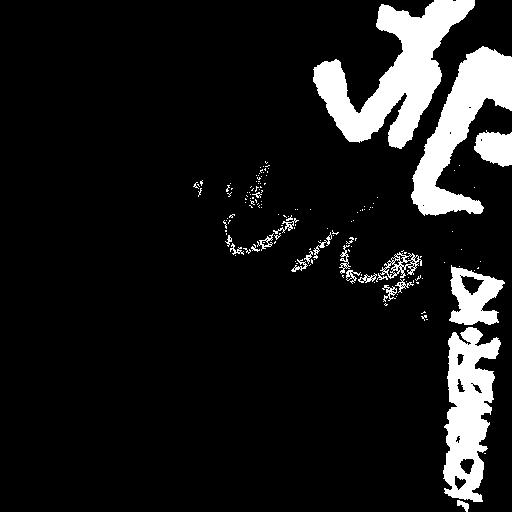

# DeepClean - Graffiti remover

There is a lot of graffiti in the beautiful streets of Prague. <br> On one of walks I wish I could see my city without it. I had an idea to create a pair of lenses that I could look through. I decided to train my own model that would be able to recognize graffiti and remove it. <br> And so I did. 🙂


## Training data

All original 238 training samples were taken on my iPhone in Prague and manually labeled using [LabelBox](https://labelbox.com/).  
Below are 5 training samples with all generated variations. Training samples have 512x512px.

For background images I made few hundred still images and also taken multiple videos of sceneries in Prague, which have been later cut into separate frames.

Rows shown below reporesents :
* **Graffiti on background** - Graffiti from original photo pasted to a new background in random orientation
* **Mask** - Mask showing where in the image graffiti is 
* **Background** - Original background without graffiti we are trying to reconstruct
* **Background without graffiti** - Used for background reconstruction

<table>
<tr>
<td></td>
<td></td>
<td></td>
<td></td>
<td></td>
</tr>
<tr>
<td></td>
<td></td>
<td></td>
<td></td>
<td></td>
</tr>
<tr>
<td></td>
<td></td>
<td></td>
<td></td>
<td></td>
</tr>
<tr>
<td></td>
<td></td>
<td></td>
<td></td>
<td></td>
</tr>
</table>

Since I had limited number of training samples, data had to be heavily augmented. Below is list of augmentations applied in different stages of preparation of training sample.

Training data was really time consuming can't be done fast enough in real-time. Therefore around 100k training samples were pre-generated before the training itself.

```python
# Augmentations applied to single graffiti sample later copied to a new background
graffiti_image_augmentations = iaa.Sequential([
    iaa.ElasticTransformation(alpha=20, sigma=4),
    iaa.Add((-4, 4), per_channel=0.5),
    iaa.Affine(shear=(-16, 16)),
    iaa.Affine(scale=(0.6, 0.9)),
    iaa.Affine(rotate=(-30, 30)),
    iaa.Affine(translate_px={
        "x": (-200, 200),
        "y": (-200, 200)
    }),
    iaa.Fliplr(0.5),
    iaa.Flipud(0.5),
    iaa.GaussianBlur(sigma=(0.0, 1.0)),
])

# Augmentations applied to a random background to be used for new graffiti sample
background_image_augmentations = iaa.Sequential([
    iaa.ElasticTransformation(alpha=20, sigma=4),
    iaa.GaussianBlur(sigma=(0.0, 2.0)),
    iaa.Affine(shear=(-3, 3)),
    iaa.Affine(rotate=(-3, 3)),
    iaa.Fliplr(0.5),
    iaa.Flipud(0.5),
    iaa.Add((-4, 4), per_channel=0.5)
])

# Augmentations applied to a final sample with graffiti on new background
final_image_augmentations = iaa.Sequential([
    iaa.ElasticTransformation(alpha=10, sigma=4),
    iaa.GaussianBlur(sigma=(0.0, 1.0)),
])
```
Each training sample can contain 1-4 of graffiti in random orientation to each other. 
Number of graffiti in training sample had following distribution : 

```python
random.choices([1, 2, 3, 4], [0.7, 0.1, 0.1, 0.1])
```

## Graffiti detection

For graffiti detection i used library [Segmentation models](https://github.com/qubvel/segmentation_models) offering multiple models. After some experimentation I have settled down on `U-Net` with `resnet34`.

Part of this project was also experimentation with different loss functions. Below are examples of generated losses on different samples, to help me understand how different losses penalize different results.

<table>
<tr>
<td></td>
<td></td>
<td></td>
</tr>
</table>


## Graffiti removal 

For graffiti removal I used great work of Mathias Gruber and his project [PConv-Keras](https://github.com/MathiasGruber/PConv-Keras). Weight supplied by this project has been fine tuned for my dataset.

## Results

I wanted model to be able to distinguish graffiti from normal city scenery, without much false positives which I think works quite satisfactory, considering that work presented here builds on only 238 graffiti samples.

More video samples can be seen on following YouTube video : 
<a href="#">

</a>

Further work could be made 

* I find PConv-Keras loss function quite interesting and more exploration is beyond scope of this project.
* Video is processed frame by frame and reconstructed background can therefore be quite noisy. It would be interesting to implement some kind of time sensitive background reconstruction.
* From my experience, most important part is reliable graffiti detection. Further work may be needed to lower false positives.

This repository has only one entry point with following options :

```
python3 -m deepclean --help
Using TensorFlow backend.
Usage: __main__.py [OPTIONS] COMMAND [ARGS]...

Options:
  --help  Show this message and exit.

Commands:
  clean-data                  Clean files in ./video_files/*.MOV
  debug-training-data         Writes training data for detector network
                              into...
  debug-validation-data       Writes training data for remover network into...
  gen-training-data           Generate training samples
  get-validation-data         Generate validation samples
  train-remover-network       Train neural network reconstructing original...
  train-segmentation-network  Train neural network detecting graffiti in...
```

This script downloads labels from LabelBox and splits training and validation sets

```
python3 download_data.py ./export.csv
```


